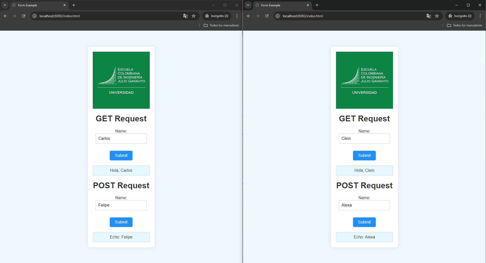

# MicroframeworksWebServer

The project is a basic implementation of a web server in Java. The server listens on port 8080 and handles HTTP requests, both GET and POST. It supports the handling of static files and the definition of dynamic routes using a custom REST interface. The key points of the project include:

**REST Interface**: Defines how requests are processed and responses are generated.

**Simple Web Server**: Listens on port 8080, handles multiple connections using a thread pool, and delegates each connection to a ClientHandler.

**Dynamic Routes**: Implements two routes (/hello and /echo) that respond with messages based on request parameters or data.

**Static File Handling**: Serves files from a specified location in the file system.

The project allows serving static content and responding to dynamic requests simply, using a basic and extensible architecture.

The following image is an example of the proyect functionality.

 

## Starting

### Previous requirements

It is necessary to have "**Maven**" and "**Java**" installed, preferably in their latest versions.

### * Maven
  ```
  Download Maven at http://maven.apache.org/download.html 

  Follow the instructions at http://maven.apache.org/download.html#Installation
  ```
### * Java

  ```
  Download Java at https://www.java.com/es/download/ie_manual.jsp
  ```

### Running

In order to use the project on your system, you can access the following link and download a compressed file of it.

You can also clone the file using the following command.

```
git clone https://github.com/Richi025/AREP-ConcurrentWebServer.git
```
if you want to run the application use the command.

```
java -jar .\target\AREP-MicroframeworksWebServer-1.0-SNAPSHOT.jar 
```


### Installing

Once you have the cloned project in your repository. Follow the steps below to launch the program successfully

1. Open a terminal and enter the folder where I clone the repository.

2. Use the following command to compile and clean the target directory.
      ```
      mvn clean compile
      ```
3. Now use the following command to package the project as a JAR file.

      ```
      mvn package
      ```

4. Now you can run the project using the following command.

      ```
      java -jar .\target\ARSW-MicroframeworksWebServer-1.0-SNAPSHOT.jar 
      ```

5. Once the program is running, open a browser and enter the following links.

* http://localhost:8080/resultado.html


  

* http://localhost:8080/index.html

  

* http://localhost:8080/google.jpg

  


## Running the tests

To run the tests you can use the following Maven command

```
mvn test
```


### Test Descriptions

1. **`testHelloServiceResponse`:**
   - Verifies that the `/hello` service responds correctly to a GET request, returning the expected message that includes the provided name (`Hola, JohnDoe`).

2. **`testLoadCSSFile`:**
   - Checks that the server can successfully load and return a CSS file (`style.css`), ensuring the HTTP response code is 200 (OK).

3. **`testFileNotFound`:**
   - Ensures that the server returns a 404 (Not Found) response code when a non-existent file (`nonexistentfile.html`) is requested.

4. **`testMultipleConnections`:**
   - Evaluates the server's ability to handle multiple simultaneous connections by repeatedly requesting a static file (`index.html`) and ensuring that all requests return a 200 (OK) response code.

5. **`testEchoServicePost`:**
   - Verifies that the `/echo` service correctly processes a POST request, returning the text sent in the request body with a "Echo:" prefix.

## Arquitecture

  

### Components

+ **Client**

  Represents the user's browser that interacts with the web server. The client sends HTTP GET and POST requests to the server, initiating the communication for different operations, such as fetching data or submitting information.

+ **Browser**

  The component where the user interacts with the web application. It consists of two forms, each corresponding to different types of HTTP requests:

  - **GET Form:** A form that sends a GET request to the server when submitted. The request is sent to the `/hello` endpoint to retrieve a response based on user input.
  - **POST Form:** A form that sends a POST request to the server. The request is sent to the `/echo` endpoint, typically containing data in the request body that the server will process and respond to.

+ **Server**

  The backend component responsible for handling incoming HTTP requests, processing them, and returning the appropriate responses. It consists of several key subcomponents:

  - **SimpleWebServer:8080**

    The core server component that listens on port 8080 for incoming connections. It manages the initial acceptance of connections and delegates the processing to specific handlers.

    - **Accepts connection:** This subcomponent listens on port 8080 and accepts incoming client connections, creating a `ClientHandler` instance to process each connection.

  - **ClientHandler**

    The component responsible for processing individual client requests. Each `ClientHandler` instance runs in a separate thread to handle a single connection, ensuring that the server can process multiple requests concurrently.

    - **Processes GET /hello:** This handler processes GET requests sent to the `/hello` endpoint, extracting parameters from the request and generating an appropriate response.
    - **Processes POST /echo:** This handler processes POST requests sent to the `/echo` endpoint, reading the request body and returning a response based on the data received.

  - **WebServer**

    A component within the server that manages routing and static file serving. It maps specific URL paths to their corresponding REST services and serves static content from the file system.

    - **Matches route /hello:** Maps the `/hello` endpoint to the corresponding service that handles GET requests.
    - **Matches route /echo:** Maps the `/echo` endpoint to the corresponding service that handles POST requests.

  - **RESTService**

    An interface defining the contract for REST services. Implementations of this interface handle the logic for specific endpoints, processing requests and generating responses.

+ **FileSystem**

  The component representing the server's file system from which static files are served. This includes HTML, CSS, images, and other resources that the client may request.

  - **/static files:** The directory containing the static files that the server can serve in response to HTTP requests. The `WebServer` component accesses this directory to fulfill requests for static content.


## Class Diagram

  

### Component Explanation

+ **RESTService**
  - This is an interface that defines the contract `getValue(String request, String response)` for the classes that implement it. It is used to handle REST requests and generate responses based on the request parameters.

+ **SimpleWebServer**
  - This is the main class that configures and manages the web server. It listens on port 8080, accepts incoming connections, and delegates them to `ClientHandler` instances for processing. Additionally, it sets up routes and the location of static files.

+ **ClientHandler**
  - Responsible for handling individual client connections. It processes HTTP GET and POST requests, delegates specific routes to `WebServer`, and serves static files from the file system. Each `ClientHandler` instance runs in a separate thread to handle a specific connection.

+ **WebServer**
  - Manages the REST services and static file handling. It allows registering dynamic routes using the `RESTService` interface, extracting parameters from requests, and configuring the location of static files to be served to clients.

+ **RESTService Interface**
  - Defines the contract for classes that implement REST services on the server. Implementations of this interface process requests and generate specific responses based on business logic, such as in the `/hello` and `/echo` routes.


## Built with

* [Maven](https://maven.apache.org/) - Dependency management
* [java](https://www.java.com/es/) - Programming language

## Versioned

We use [Git](https://github.com/) for version control. For available versions, see the tags in this repository.

## Authors

* **Jose Ricardo Vasquez Vega** - [Richi025](https://github.com/Richi025)

## Date

Wednesday, August 28, 2024

## License

This project is licensed under the GNU license; See the [LICENSE.txt](LICENSE.txt) file for details.