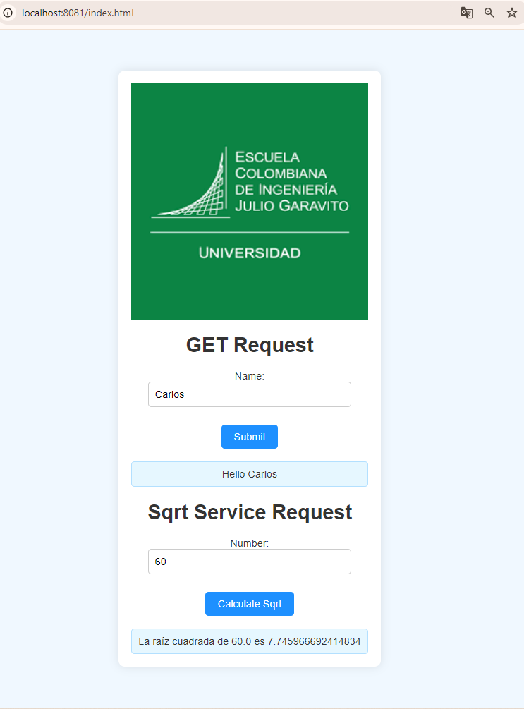
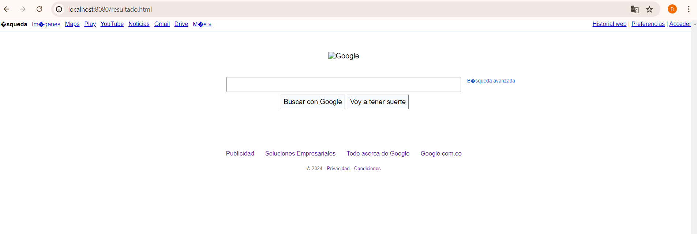
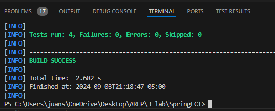
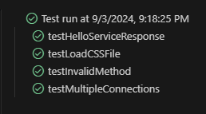
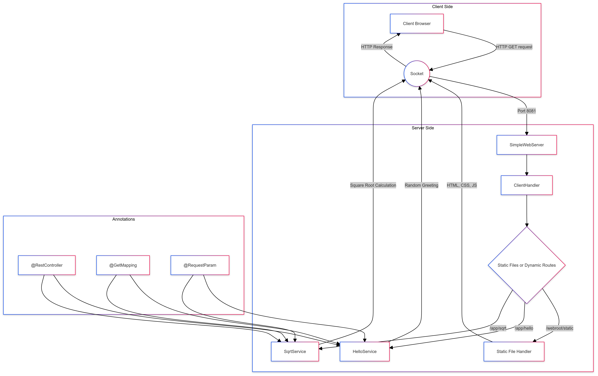
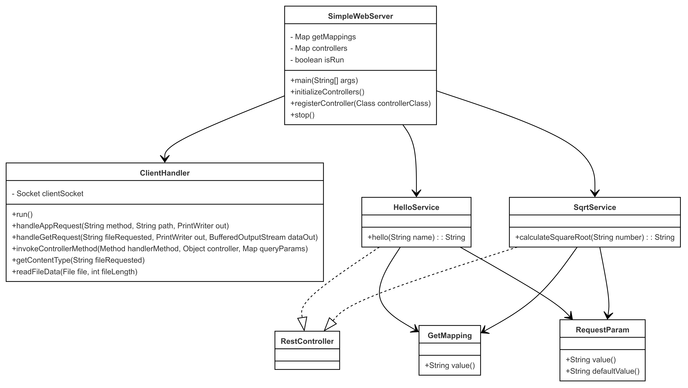

# SpringECI

The project provides the implementation of a basic multithreaded HTTP web server in Java that handles static and dynamic content through a simple REST framework. The framework uses custom annotations to map HTTP GET requests and parameters to methods in controller classes.

 

## Starting

### Previous requirements

It is necessary to have "**Maven**" and "**Java**" installed, preferably in their latest versions.

### * Maven
  ```
  Download Maven at http://maven.apache.org/download.html 

  Follow the instructions at http://maven.apache.org/download.html#Installation
  ```
### * Java

  ```
  Download Java at https://www.java.com/es/download/ie_manual.jsp
  ```

### Running

In order to use the project on your system, you can access the following link and download a compressed file of it.

You can also clone the file using the following command.

```
git clone https://github.com/Richi025/SpringECI.git 
```
if you want to run the application use the command.

```
java -jar .\target\SpringECI-1.0-SNAPSHOT.jar 
```


### Installing

Once you have the cloned project in your repository. Follow the steps below to launch the program successfully

1. Open a terminal and enter the folder where I clone the repository.

2. Use the following command to compile and clean the target directory.
      ```
      mvn clean compile
      ```
3. Now use the following command to package the project as a JAR file.

      ```
      mvn package
      ```

4. Now you can run the project using the following command.

      ```
      java -jar .\target\SpringECI-1.0-SNAPSHOT.jar 
      ```

5. Once the program is running, open a browser and enter the following links.

* http://localhost:8080/resultado.html


  

* http://localhost:8080/index.html

  

* http://localhost:8080/google.jpg

  


## Running the tests

To run the tests you can use the following Maven command

```
mvn test
```





### Test Descriptions

1. **`testHelloServiceResponse`:**
   - Verifies that the `/app/hello` service responds correctly to a GET request, returning a message that includes the provided name (`JohnDoe`). The response should match one of the expected greeting formats (e.g., "Hello JohnDoe").

2. **`testLoadCSSFile`:**
   - Checks that the server can successfully load and return a CSS file (`style.css`), ensuring the HTTP response code is 200 (OK). This test confirms that static file serving is functioning correctly.

3. **`testInvalidMethod`:**
   - Ensures that the server correctly handles invalid HTTP methods by returning a 405 (Method Not Allowed) response code when a DELETE request is sent to the `/app/hello` endpoint, which only supports GET.

4. **`testMultipleConnections`:**
   - Evaluates the server's ability to handle multiple simultaneous connections. This test submits several concurrent GET requests for the `index.html` file and checks that each request returns a 200 (OK) response code, confirming the server's robustness under load.


## Arquitecture

  

### Components

+ **Client Side**: The client's browser sends HTTP GET requests through a socket.

+ **Server Side**:
  - The server listens on port 8081.
  - Requests are handled by the `SimpleWebServer`, which distributes requests between controllers or manages static files.
  - Depending on the route (`/app/hello` or `/app/sqrt`), the corresponding services (`HelloService`, `SqrtService`) are called, responding dynamically.
  - The server can also serve static files from the `webroot` directory.

+ **Annotations**:
  - The `HelloService` and `SqrtService` classes are annotated with `@RestController`, and the methods are linked with routes using `@GetMapping` and parameters through `@RequestParam`.


## Class Diagram

  

### Component Explanation

+ **SimpleWebServer**
  - The main class that handles incoming connections, registers controllers, and their methods. It listens on port 8081 and manages both static and dynamic requests through controllers.

+ **ClientHandler**
  - Responsible for processing incoming HTTP requests, either serving static files or invoking controller methods for dynamic requests. Each `ClientHandler` instance runs on a separate thread to handle specific connections.

+ **HelloService** and **SqrtService**
  - Controller classes annotated with `@RestController`, each handling HTTP GET requests for specific routes like `/app/hello` and `/app/sqrt`. They provide dynamic functionalities such as generating greeting messages or calculating the square root of a number.

+ **Annotations**
  - **@GetMapping**: Annotation used to map HTTP GET routes to specific methods within the controllers.
  - **@RequestParam**: Annotation that binds HTTP request parameters to method parameters, allowing values from the URL to be passed into methods.
  - **@RestController**: Annotation to indicate that a class is a REST controller, capable of handling HTTP requests and generating responses in formats like JSON or plain text.

## Built with

* [Maven](https://maven.apache.org/) - Dependency management
* [java](https://www.java.com/es/) - Programming language

## Versioned

We use [Git](https://github.com/) for version control. For available versions, see the tags in this repository.

## Authors

* **Jose Ricardo Vasquez Vega** - [Richi025](https://github.com/Richi025)

## Date

Wednesday, September 04, 2024

## License

This project is licensed under the GNU license; See the [LICENSE.txt](LICENSE.txt) file for details.